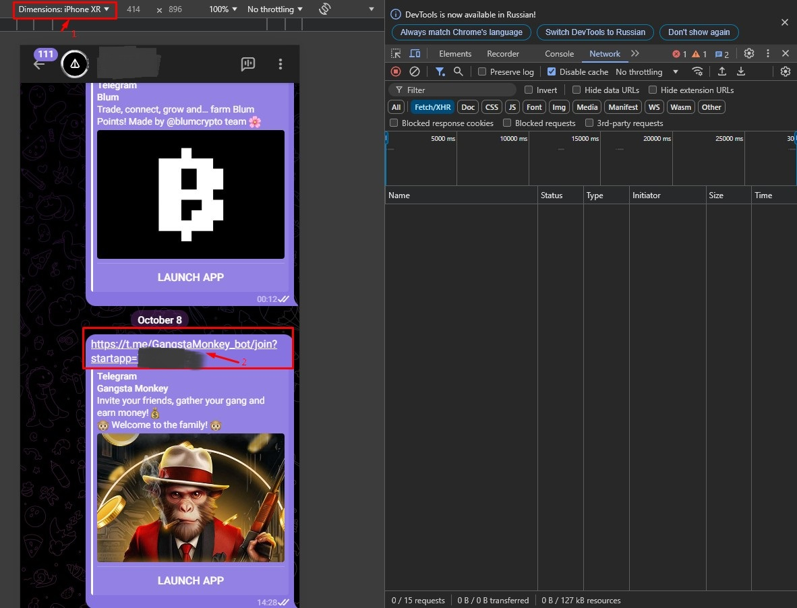
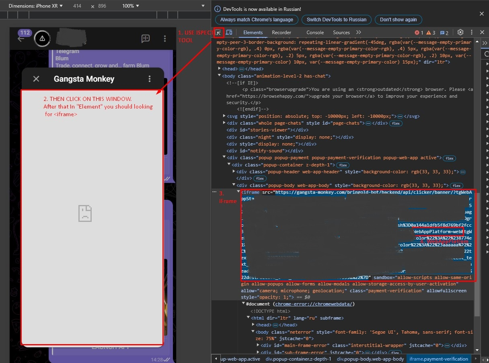
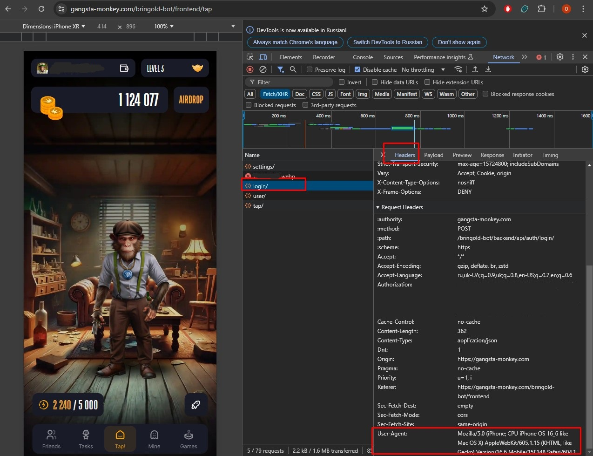
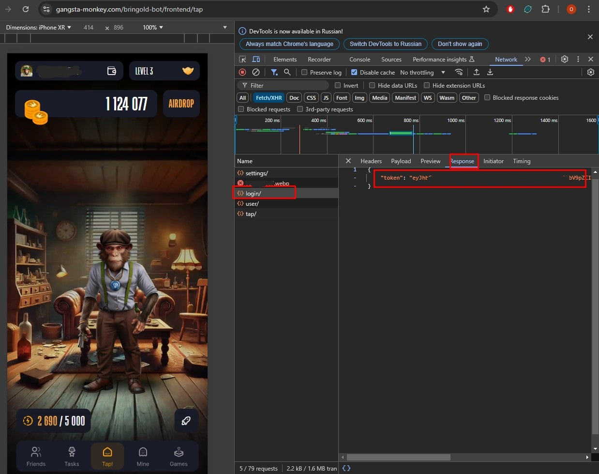
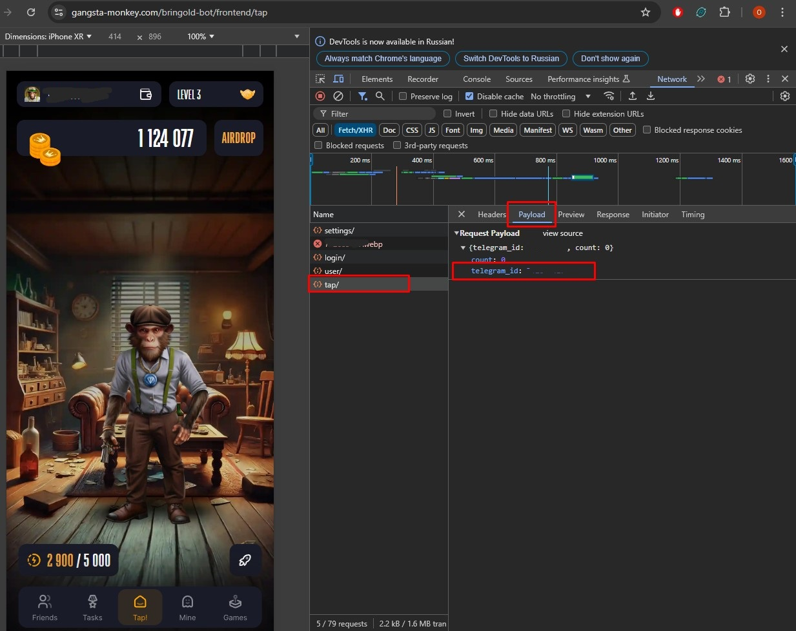

# Sessions creation guide

## Guide steps
#### I. Telegram login
1. Go to the web version of [Telegram](https://web.telegram.org/)
2. Login
3. Press 12 to switch to open DevTool
3. Select which device emulate `1` 
4. Go to the chat where you can launch app from referral link
5. Click referral link `2`
6. After that app window should pop up

#### II. Launch App in Browser
1. Click on InspectTool `1`
2. Point it on app window area `2`
3. In `Elements` tab search for <iframe> tag `3`
4. Expand it and change WebAppPlatform=web to WebAppPlatform=android | ios (which emulating device your were selected)
5. Copy that URL and paste it adress line, Press Enter
6. App should be launched in the Browser
  

#### III. Get data for session
1. Select `Fetch/XHR`
2. Press F5
2. Look for `login/` -> Headers -> Copy `User-Agent`
3. Payload -> Copy `init_data` and `referrer`
4. Response -> Copy `access token`
5. Look for `tap/` -> Payload -> Copy `telegram_id`

#### IV. Create session file
> [!NOTE]
> if `"referrer": null` paste your `telegram_id` insted of `null`.

1. Paste all this data to `session_example.json` in `sessions/` folder and rename it
2. Repeat all this steps for adding other accounts
___
**Now we are done.**

___
